# Webserver_education_Django_python

This is a web-based educational platform developed using Django (Python) as the backend framework, MySQL (via XAMPP) as the database, and HTML/CSS for the frontend UI.

## 📚 Features Overview

### 🔐 Login Page
Displays a login form for users to authenticate.

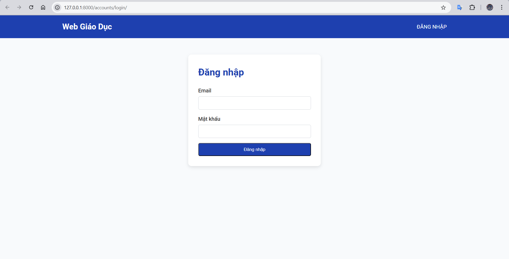

---

### 🏠 Home Page
After a successful login, users are taken to the homepage which displays:
- User information (name, email)
- A list of available courses from the database
- User-specific access rights for each course
- A **Logout** button


---

### 📖 Chapter Content Page
Displays all chapters of a selected course retrieved from the database.

- A **Start Final Test** button is provided for each chapter
- Previous final test result is also shown

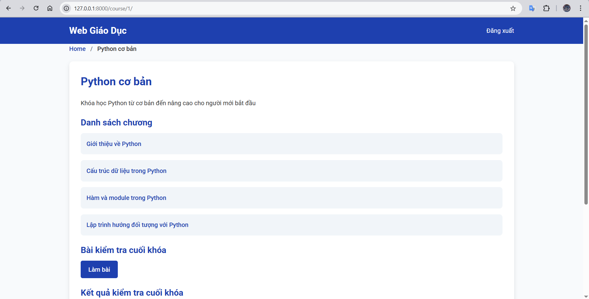
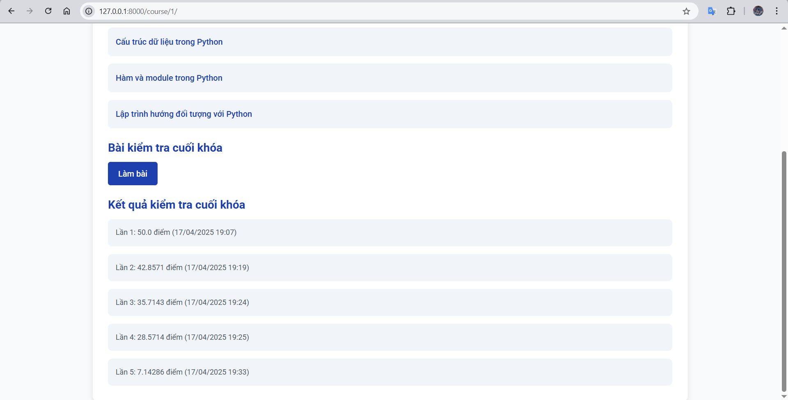

---

### 🧾 Lesson Content Page
Shows the list of lessons under a chapter, loaded from the database.

- Button to take chapter tests
- Previously saved test results

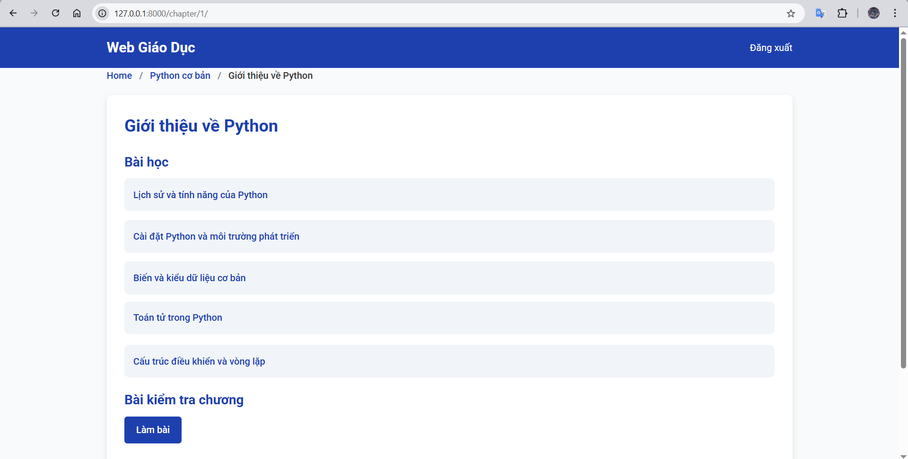
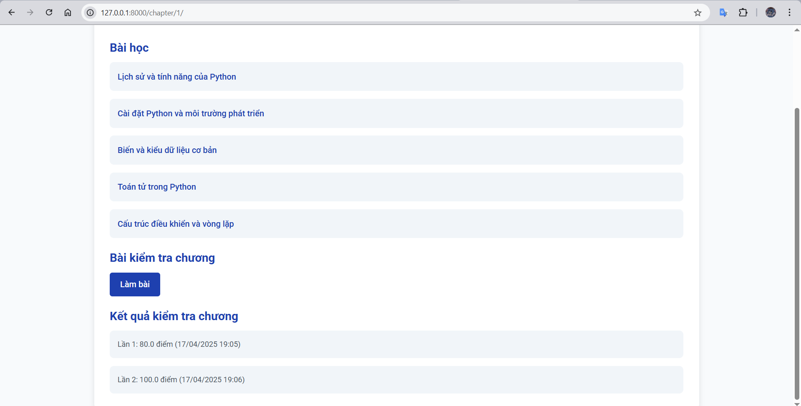

---

### 📄 Lesson Pages Display
Each lesson contains multiple pages. When clicked, the detailed content of each page is shown.

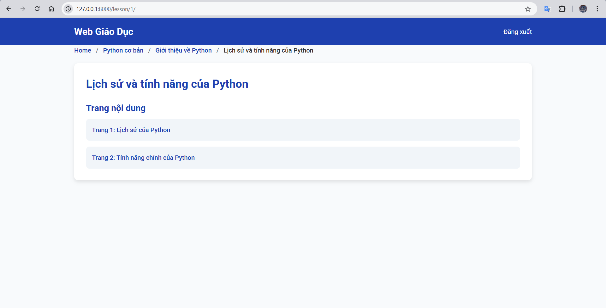
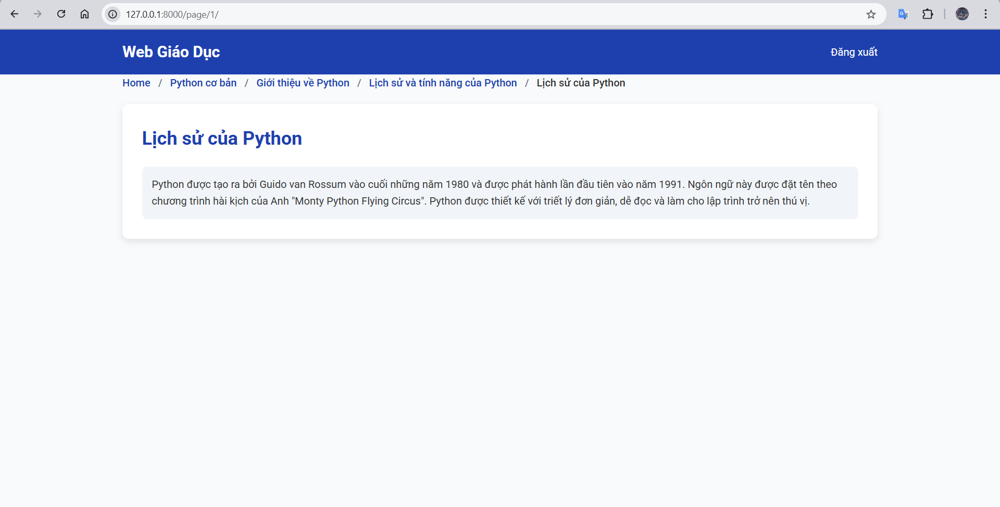

---

### 🧠 Final Test Interface
The final test consists of multiple randomly selected questions across all chapters, based on a rule like `3-3-4-4`:
- 3 questions from chapter 1
- 3 from chapter 2
- 4 from chapter 3 and 4

Python's `random` module is used to shuffle the questions each time.

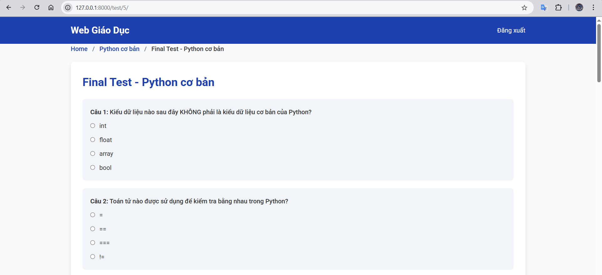
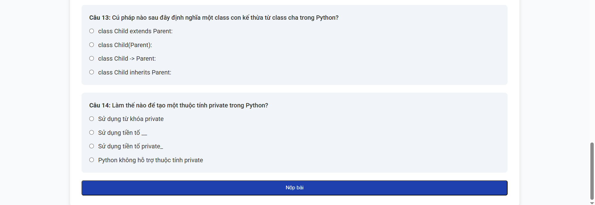

---

### 📝 Chapter Test Interface
Displays randomly selected questions for a single chapter, based on a fixed number (e.g., 5 questions).

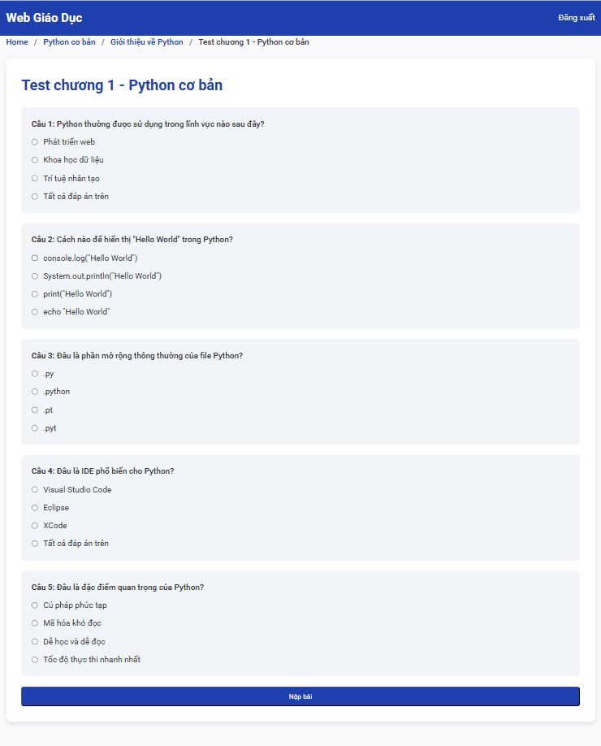

---

### ✅ Test Results Page
Displays the result after submitting a test (either final or chapter test):
- Score
- Attempt number
- Time of completion
- Button to retake the test (new questions will be selected randomly)

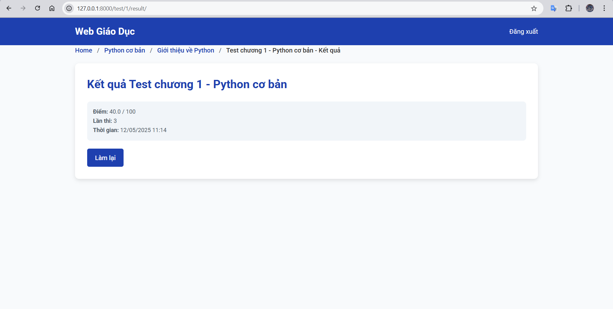

---

## 🧰 Technologies Used
- **Backend**: Django (Python)
- **Frontend**: HTML, CSS
- **Database**: MySQL (via XAMPP)
- **Other**: Python `random` module for test generation

---

## 🚀 Getting Started

### Prerequisites
- Python 3.x
- Django installed (`pip install django`)
- MySQL running (via XAMPP)

### Run the project locally:
```bash
python manage.py makemigrations
python manage.py migrate
python manage.py runserver
```

Access the server at: `http://127.0.0.1:8000/`

---
